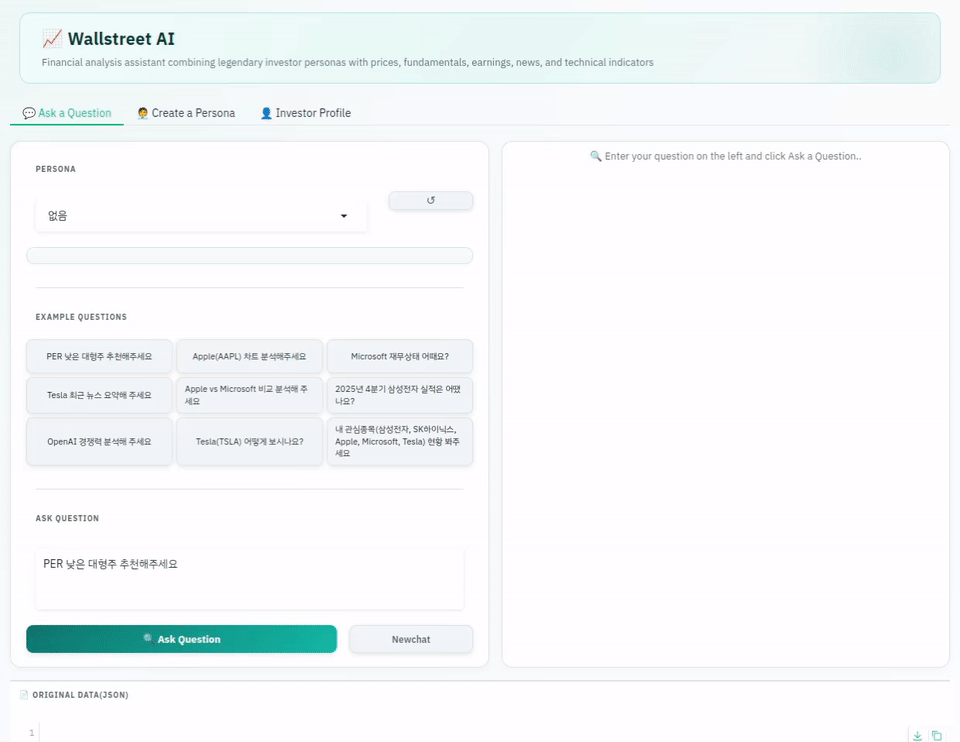

<div align="center">


# Wallstreet-AI

**An agentic financial analysis assistant powered by legendary investor personas.**

Combine the investment philosophies of Warren Buffett, Charlie Munger, and other market legends with a structured AI pipeline — delivering SWOT analyses, technical reports, earnings breakdowns, and more, all streamed in real time.

[](https://www.python.org/)
[](https://fastapi.tiangolo.com/)
[](https://gradio.app/)
[](https://platform.openai.com/)

[](https://deepwiki.com/davidkim205/wallstreet-ai)

[](https://colab.research.google.com/drive/1GUbw0Ef0bJQfkddrDNCuvADXG3ujxo9H)
[](https://huggingface.co/spaces/davidkim205/wallstreet-ai)

<p align="center">
  <a href="README.md">🇺🇸 English</a> |
  <a href="README_KR.md">🇰🇷 한국어</a>
</p>
</div>

---

## Why Wallstreet-AI?

Traditional financial tools give you data. Wallstreet-AI gives you *interpretation*.

Instead of reading raw numbers, you ask a question the way you'd ask a mentor — and receive a structured, persona-driven analysis that thinks through the data the way a legendary investor would.

- Warren Buffett would ask: *"Does this business have a durable moat?"*
- Charlie Munger would ask: *"Am I avoiding the big mistakes?"*
- You just ask: *"Should I be worried about Apple's margins?"*

---

## What is Wallstreet-AI?

Wallstreet-AI turns a plain-language question like *"What would Warren Buffett think of Apple's latest earnings?"* into a fully structured analysis pipeline:

1. **Intent parsing** — extracts ticker, analysis type, time period, and earnings quarter from your question
2. **Tool routing** — selects only the data sources required for that analysis type
3. **Data collection** — fetches prices, fundamentals, technicals, earnings, and news via `yfinance` and Google News RSS
4. **News enrichment** — scrapes article bodies to build real-time news context
5. **LLM generation** — streams a tailored report through the OpenAI Responses API
6. **Result storage** — saves every analysis and persona to JSONL for later review

You can apply an investor persona at any stage. The same underlying data produces a completely different report depending on whether you view it through a value-investing lens or a growth-focused one.

---

## Demo

### Streaming stock analysis

### Warren Buffett
- Question : Is Apple still an attractive long-term investment in a high interest rate environment?
- Answer : Apple remains a compelling long-term investment due to its strong business quality and cash generation, but in a high interest rate environment, elevated valuation can increase downside risk. Long-term investors should approach it with an ownership mindset, carefully considering both fundamentals and the discount rate when determining entry price and a disciplined, staggered buying strategy.



### Ray Dalio
- Question : Is Apple still an attractive long-term investment in a high interest rate environment?
- Answer : Apple can still fit in a long-term portfolio given its margins, ecosystem, and financial flexibility, but its current premium valuation means it is not an automatic buy, especially in a high interest rate environment. Investors should determine entry timing and position sizing based on their required return, while balancing diversification and overall portfolio risk.


---

## Key Features

| Feature | Details |
|---|---|
| **Natural-language intent parsing** | Extracts ticker, analysis type, period, and year/quarter automatically |
| **7 analysis report types** | General · Technical · Fundamental · Earnings · SWOT · News summary · Comparative |
| **Investor personas** | Warren Buffett, Charlie Munger, and any figure you define — tone and reasoning style adapt to the persona |
| **Technical indicators** | RSI, MACD, moving averages (SMA/EMA), Bollinger Bands |
| **Real-time news context** | Google News RSS + `trafilatura` article body extraction |
| **SSE streaming** | Token-by-token response streaming via FastAPI Server-Sent Events |
| **Three entry points** | CLI · FastAPI REST API · Gradio web UI |
| **JSONL logging** | All analyses and personas persisted for reproducibility |

---

## Quick Start

> Requires Python 3.10+ and an OpenAI API key.

```bash
# 1. Clone and enter the repo
git clone https://github.com/davidkim205/wallstreet-ai-ai.git
cd wallstreet-ai

# 2. Create a virtual environment
uv venv
source .venv/bin/activate   # Windows: .venv\Scripts\activate

# 3. Install dependencies
uv pip install -r requirements.txt

# 4. Set up environment variables
cp .env.example .env
# Open .env and add your LLM_MODEL_API_KEY

# 5a. Run the FastAPI server (for web UI or API access)
uvicorn api_server:app --reload

# 5b. In a second terminal, launch the Gradio UI
python gradio_app.py --api-url http://127.0.0.1:8000/analyze/
```

Then open your browser at `http://localhost:7860` and ask anything:

> *"Give me a Warren Buffett-style fundamental analysis of Microsoft for the last 2 years"*

To use the CLI only, skip step 5a and run `python pipeline.py` directly.

---
## Online Demo

You can try Wallstreet-AI instantly without installing anything.<br>
Click the platform name to open.

| Platform | Description |
|---|---|
| [**Google Colab**](https://colab.research.google.com/drive/1GUbw0Ef0bJQfkddrDNCuvADXG3ujxo9H) | Run the full pipeline in a hosted notebook.<br> Installs the GitHub repo and allows interactive testing. |
| [**HuggingFace Spaces**](https://huggingface.co/spaces/davidkim205/wallstreet-ai) | Live web demo similar to Gradio UI for quick experimentation. |

---

## Installation

### Python environment

Python 3.10 or later is recommended. Using `uv` is strongly advised for faster installs:

```bash
uv venv
source .venv/bin/activate
uv pip install -r requirements.txt
```

### Environment variables

```bash
cp .env.example .env
```

Edit `.env` with your credentials:

```env
LLM_MODEL_NAME=gpt-4o-mini
LLM_MODEL_API_KEY=<your OpenAI API key>
LOG_FILE=analysis_results.jsonl
PERSONA_FILE=persona.jsonl
```

| Variable | Description |
|---|---|
| `LLM_MODEL_NAME` | Model name passed to the OpenAI client |
| `LLM_MODEL_API_KEY` | OpenAI API key (falls back to `OPENAI_API_KEY` if unset) |
| `LOG_FILE` | Path for analysis result logs (JSONL) |
| `PERSONA_FILE` | Path for saved investor personas (JSONL) |

---

## How to Run

### CLI

```bash
python pipeline.py
```

At startup the CLI lists saved personas. Enter a persona number to apply it, or press Enter to skip. After entering your question the pipeline runs and prints the full report plus a data summary.

Exit with `exit`, `quit`, or `종료`.

### FastAPI server

```bash
uvicorn api_server:app --reload
```

Starts at `http://127.0.0.1:8000`. Available endpoints:

| Method | Endpoint | Description |
|---|---|---|
| `POST` | `/analyze/` | Run a full analysis (streaming or batch) |
| `POST` | `/persona/` | Generate and save a new investor persona |

### Gradio UI

Start the FastAPI server first, then:

```bash
python gradio_app.py --api-url http://127.0.0.1:8000/analyze/
```

Default binding: `0.0.0.0:7860`

| Option | Description |
|---|---|
| `--api-url` | SSE endpoint for the analysis pipeline |
| `--port` | Gradio server port |
| `--server-name` | Binding address |
| `--share` | Generate a public Gradio share link |

The UI has three tabs: **Ask a Question**, **Create a Persona**, and **Investor Profile**.

---

## API Reference

### Analysis — batch mode

```bash
curl -X POST "http://127.0.0.1:8000/analyze/" \
  -H "Content-Type: application/json" \
  -d '{
    "query": "Summarize AAPL recent earnings and key investment points",
    "stream": false
  }'
```

Response:

```json
{
  "type": "result",
  "query": "Summarize AAPL recent earnings and key investment points",
  "ticker": "AAPL",
  "analysis_type": "earnings",
  "data_context": {},
  "llm_response": "...",
  "timestamp": "2026-03-30 10:00:00",
  "stdout": "..."
}
```

### Analysis — multi-turn conversation

Send the current question in `query` and the previous turns in `history`.

```bash
curl -X POST "http://127.0.0.1:8000/analyze/" \
  -H "Content-Type: application/json" \
  -d '{
    "query": "Was it up compared with Q3?",
    "history": [
      {"role": "user", "content": "What was NVIDIA revenue in Q4 FY2025?"},
      {"role": "assistant", "content": "Revenue was about $68.1 billion."}
    ],
    "stream": false
  }'
```

### Analysis — streaming mode

```bash
curl -N -X POST "http://127.0.0.1:8000/analyze/" \
  -H "Content-Type: application/json" \
  -d '{"query": "Summarize AAPL recent earnings", "stream": true}'
```

SSE event sequence:

```
data: {"type":"status","message":"Parsing intent..."}
data: {"type":"stdout","message":"[③] Collecting data (ticker=AAPL, period=1y)..."}
data: {"type":"delta","delta":"Apple's most recent quarter shows margin expansion..."}
data: {"type":"result","ticker":"AAPL","analysis_type":"earnings", ...}
data: {"type":"done"}
```

| Event type | Meaning |
|---|---|
| `status` | High-level pipeline progress |
| `stdout` | Server-side log lines |
| `delta` | Incremental model output tokens |
| `result` | Final structured payload |
| `done` | Stream complete |

### Analysis with a persona

```bash
curl -X POST "http://127.0.0.1:8000/analyze/" \
  -H "Content-Type: application/json" \
  -d '{
    "query": "SWOT analysis of Samsung Electronics",
    "stream": false,
    "persona_name": "Warren Buffett"
  }'
```

### Create a persona

```bash
curl -X POST "http://127.0.0.1:8000/persona/" \
  -H "Content-Type: application/json" \
  -d '{"info": "Warren Buffett"}'
```

---

## Persona System

The persona system rewrites the analysis prompt to reflect a specific investor's voice and reasoning style. When a persona is active, the model receives:

- A summary of the figure's background and track record
- Their core financial mindset and mental models
- Their preferred data analysis style (e.g. DCF-focused vs. narrative-focused)
- Their typical response tone and vocabulary
- Core investment principles
- Representative quotes

---

## Contributing

Contributions are welcome. Please open an issue first to discuss significant changes. For small fixes, a pull request with a clear description is sufficient.

---

## License

See [LICENSE](LICENSE) for details.

---

<div align="center">

*Ask any stock question. Get an answer that thinks like the greats.*

</div>
