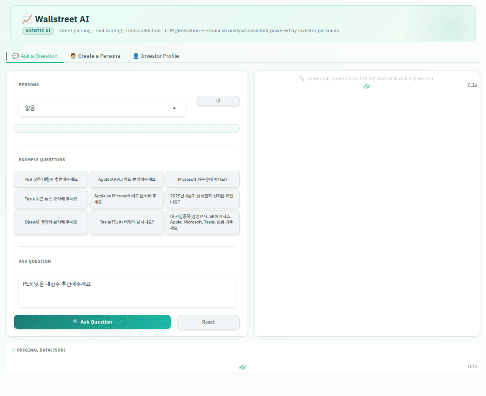
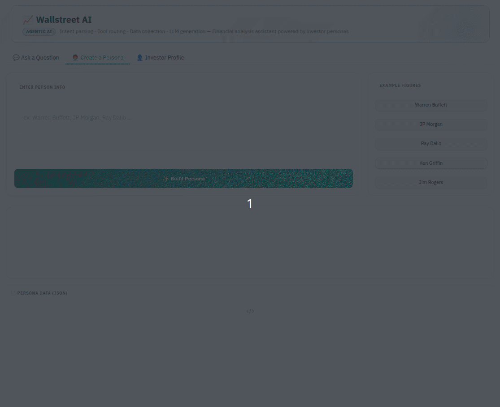

<div align="center">


# Wallstreet-AI

**투자 대가 페르소나 기반의 에이전트형 금융 분석 어시스턴트**

Warren Buffett, Charlie Munger 등 전설적인 투자자들의 철학을 반영한 페르소나와 구조화된 AI 파이프라인을 결합해, SWOT 분석, 기술적 분석, 실적 요약 등 다양한 투자 인사이트를 실시간으로 제공합니다.

[](https://www.python.org/)
[](https://fastapi.tiangolo.com/)
[](https://gradio.app/)
[](https://platform.openai.com/)

[](https://deepwiki.com/davidkim205/wallstreet-ai)

[](https://colab.research.google.com/drive/1GUbw0Ef0bJQfkddrDNCuvADXG3ujxo9H)
[](https://huggingface.co/spaces/davidkim205/wallstreet-ai)

<p align="center">
  <a href="README.md">🇺🇸 English</a> |
  <a href="README_kr.md">🇰🇷 한국어</a>
</p>
</div>

---

## Wallstreet-AI가 필요한 이유

기존 금융 도구는 데이터를 보여줍니다. Wallstreet-AI는 그 데이터를 **해석합니다.**

복잡한 숫자를 일일이 분석할 필요 없이, 질문 하나만으로 유명 투자자의 시각을 반영한 구조화된 분석을 얻을 수 있습니다.

- Warren Buffett → "이 기업은 장기적으로 경쟁력을 유지할 수 있는가?"
- Charlie Munger → "나는 지금 중요한 리스크를 간과하고 있지 않은가?"
- Wallstreet-AI 사용자 → "애플 수익 괜찮은가요?"

---

## Wallstreet-AI란?

Wallstreet-AI는 *"워런 버핏은 애플의 최근 실적을 어떻게 볼까?"* 같은 자연어 질문을 완전한 구조의 분석 파이프라인으로 변환합니다.

1. **의도 파싱**: 질문에서 티커, 분석 유형, 기간, 실적 분기 정보를 추출합니다.
2. **도구 라우팅**: 분석 유형에 필요한 데이터 소스만 선택합니다.
3. **데이터 수집**: `yfinance`와 Google News RSS를 통해 가격, 펀더멘털, 기술 지표, 실적, 뉴스 데이터를 수집합니다.
4. **뉴스 보강**: 기사 본문을 스크래핑하여 실시간 뉴스 맥락을 보강합니다.
5. **LLM 생성**: OpenAI Responses API를 통해 맞춤형 리포트를 스트리밍 방식으로 생성합니다.
6. **결과 저장**: 모든 분석 결과와 페르소나를 JSONL 형식으로 저장해 재사용할 수 있습니다.

투자자 페르소나는 모든 단계에 적용할 수 있으며, 동일한 데이터라도 가치 투자 관점인지 성장 투자 관점인지에 따라 전혀 다른 분석 결과가 생성됩니다.

---

## 데모

### 실시간 주식 분석



### 페르소나 생성



---

## 주요 기능

| 기능 | 설명 |
|---|---|
| **자연어 의도 파싱** | 티커, 분석 유형, 기간, 연도/분기를 자동으로 추출 |
| **7가지 분석 유형** | 일반 · 기술적 분석 · 펀더멘털 · 실적 · SWOT · 뉴스 요약 · 비교 분석 |
| **투자자 페르소나** | Warren Buffett, Charlie Munger, 또는 사용자가 정의한 임의의 인물까지 반영 가능 |
| **기술 지표 지원** | RSI, MACD, 이동평균선(SMA/EMA), 볼린저 밴드 |
| **실시간 뉴스 데이터** | Google News RSS + `trafilatura` 기반 기사 본문 추출 |
| **SSE 스트리밍** | FastAPI Server-Sent Events를 통한 토큰 단위 응답 스트리밍 |
| **3가지 실행 방식** | CLI · FastAPI REST API · Gradio 웹 UI |
| **JSONL 로깅** | 모든 분석과 페르소나를 재현 가능하도록 저장 |

---

## 빠른 시작

> Python 3.10 이상과 OpenAI API 키가 필요합니다.

```bash
# 1. 저장소 클론 및 이동
git clone https://github.com/davidkim205/wallstreet-ai-ai.git
cd wallstreet-ai

# 2. 가상환경 생성
uv venv
source .venv/bin/activate   # Windows: .venv\Scripts\activate

# 3. 의존성 설치
uv pip install -r requirements.txt

# 4. 환경 변수 설정
cp .env.example .env
# .env를 열어 LLM_MODEL_API_KEY 값을 입력하세요

# 5a. FastAPI 서버 실행 (웹 UI 또는 API 사용 시)
uvicorn api_server:app --reload

# 5b. 두 번째 터미널에서 Gradio UI 실행
python gradio_app.py --api-url http://127.0.0.1:8000/analyze/
```

이후 브라우저에서 `http://localhost:7860`에 접속해 질문을 입력하세요.

> *"지난 2년 기준으로 마이크로소프트를 워런 버핏 스타일의 펀더멘털 분석으로 정리해줘"*

CLI만 사용할 경우 5a 단계는 건너뛰고 `python pipeline.py`만 실행하면 됩니다.

---

## 온라인 데모

설치 없이 바로 Wallstreet-AI를 체험할 수 있습니다.
플랫폼 이름을 클릭하면 실행 페이지로 이동합니다.

| 플랫폼 | 설명 |
|---|---|
| [**Google Colab**](https://colab.research.google.com/drive/1GUbw0Ef0bJQfkddrDNCuvADXG3ujxo9H) | 호스팅된 노트북 환경에서 전체 파이프라인을 실행합니다.<br>GitHub 저장소를 설치하고 직접 테스트할 수 있습니다. |
| [**HuggingFace Spaces**](https://huggingface.co/spaces/davidkim205/wallstreet-ai) | Gradio 기반의 라이브 웹 데모로, 빠르게 기능을 체험할 수 있습니다. |

---

## 설치

### Python 환경

Python 3.10 이상을 권장하며, `uv`를 사용하면 더 빠르게 설치할 수 있습니다.

```bash
uv venv
source .venv/bin/activate
uv pip install -r requirements.txt
```

### 환경 변수

```bash
cp .env.example .env
```

이후 `.env`를 열어 아래 값을 설정하세요.

```env
LLM_MODEL_NAME=gpt-4o-mini
LLM_MODEL_API_KEY=<your OpenAI API key>
LOG_FILE=analysis_results.jsonl
PERSONA_FILE=persona.jsonl
```

| 변수 | 설명 |
|---|---|
| `LLM_MODEL_NAME` | OpenAI 클라이언트에 전달할 모델 이름 |
| `LLM_MODEL_API_KEY` | OpenAI API 키 (설정하지 않은 경우 `OPENAI_API_KEY` 사용) |
| `LOG_FILE` | 분석 결과 로그(JSONL) 저장 경로 |
| `PERSONA_FILE` | 투자자 페르소나(JSONL) 저장 경로 |

---

## 실행 방법

### CLI

```bash
python pipeline.py
```

CLI를 실행하면 저장된 페르소나 목록이 먼저 표시됩니다. Enter를 눌러 건너뛰거나 번호를 입력해 원하는 페르소나를 적용할 수 있습니다. 이후 질문을 입력하면 파이프라인이 실행되고 전체 리포트와 데이터 요약이 출력됩니다.

종료 명령은 `exit`, `quit`, `종료`를 지원합니다.

### FastAPI 서버

```bash
uvicorn api_server:app --reload
```

서버는 `http://127.0.0.1:8000`에서 실행됩니다. 사용 가능한 엔드포인트는 다음과 같습니다.

| 메서드 | 엔드포인트 | 설명 |
|---|---|---|
| `POST` | `/analyze/` | 전체 분석 실행(스트리밍 또는 배치) |
| `POST` | `/persona/` | 새 투자자 페르소나 생성 및 저장 |

### Gradio UI

먼저 FastAPI 서버를 실행한 뒤 아래 명령을 실행합니다.

```bash
python gradio_app.py --api-url http://127.0.0.1:8000/analyze/
```

기본 바인딩 주소는 `0.0.0.0:7860`입니다.

| 옵션 | 설명 |
|---|---|
| `--api-url` | 분석 파이프라인 SSE 엔드포인트 |
| `--port` | Gradio 서버 포트 |
| `--server-name` | 바인딩 주소 |
| `--share` | 공개 Gradio 공유 링크 생성 |

UI는 **Ask a Question**, **Create a Persona**, **Investor Profile**의 세 탭으로 구성됩니다.

---

## API 레퍼런스

### 분석 API - 배치 모드

```bash
curl -X POST "http://127.0.0.1:8000/analyze/" \
  -H "Content-Type: application/json" \
  -d '{
    "query": "AAPL의 최근 실적과 핵심 투자 포인트를 요약해줘",
    "stream": false
  }'
```

응답 예시:

```json
{
  "type": "result",
  "query": "AAPL의 최근 실적과 핵심 투자 포인트를 요약해줘",
  "ticker": "AAPL",
  "analysis_type": "earnings",
  "data_context": {},
  "llm_response": "...",
  "timestamp": "2026-03-30 10:00:00",
  "stdout": "..."
}
```

### 분석 API - 멀티턴 대화

현재 질문은 `query`에, 이전 대화는 `history`에 담아 전송합니다.

```bash
curl -X POST "http://127.0.0.1:8000/analyze/" \
  -H "Content-Type: application/json" \
  -d '{
    "query": "그럼 Q3와 비교하면 증가한 건가요?",
    "history": [
      {"role": "user", "content": "NVIDIA의 FY2025 Q4 매출은 얼마였나요?"},
      {"role": "assistant", "content": "매출은 약 681억 달러였습니다."}
    ],
    "stream": false
  }'
```

### 분석 API - 스트리밍 모드

```bash
curl -N -X POST "http://127.0.0.1:8000/analyze/" \
  -H "Content-Type: application/json" \
  -d '{"query": "AAPL 최근 실적 요약", "stream": true}'
```

SSE 이벤트 시퀀스 예시:

```
data: {"type":"status","message":"Parsing intent..."}
data: {"type":"stdout","message":"[③] Collecting data (ticker=AAPL, period=1y)..."}
data: {"type":"delta","delta":"Apple's most recent quarter shows margin expansion..."}
data: {"type":"result","ticker":"AAPL","analysis_type":"earnings", ...}
data: {"type":"done"}
```

| 이벤트 타입 | 의미 |
|---|---|
| `status` | 파이프라인 진행 상태 |
| `stdout` | 서버 측 로그 출력 |
| `delta` | 모델이 생성 중인 토큰 |
| `result` | 최종 구조화 결과 |
| `done` | 스트림 종료 |

### 페르소나 기반 분석

```bash
curl -X POST "http://127.0.0.1:8000/analyze/" \
  -H "Content-Type: application/json" \
  -d '{
    "query": "삼성전자 SWOT 분석",
    "stream": false,
    "persona_name": "Warren Buffett"
  }'
```

### 페르소나 생성

```bash
curl -X POST "http://127.0.0.1:8000/persona/" \
  -H "Content-Type: application/json" \
  -d '{"info": "Warren Buffett"}'
```

---

## 페르소나 시스템

페르소나 시스템은 특정 투자자의 말투와 사고방식을 반영하도록 분석 프롬프트를 재구성합니다. 페르소나가 활성화되면 모델은 다음 정보를 함께 전달받습니다.

- 인물의 배경 및 주요 이력 요약
- 핵심 재무 관점과 사고 프레임
- 선호하는 데이터 분석 방식 (예: DCF 중심, 내러티브 중심)
- 응답 톤과 어휘 스타일
- 핵심 투자 원칙
- 대표 인용문

---

## 참여하기

프로젝트 참여는 언제든 환영합니다. 큰 변경 사항은 먼저 이슈를 통해 논의해 주세요. 작은 수정은 명확한 설명과 함께 Pull Request를 보내주시면 됩니다.

---

## 라이선스

자세한 내용은 [LICENSE](LICENSE)를 참고하세요.

---

<div align="center">

*어떤 종목이든 질문하세요. 위대한 투자자처럼 사고하는 답변을 받아보세요.*

</div>
